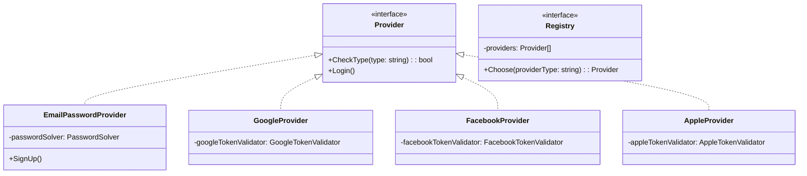

# Authorization Service Documentation

---

### Commands

To format comments and generate swagger docs run `make generate-swagger-docs`

To access swagger docs visit `/swagger/index.html`

---

### How to declare swagger fields for documentation

1. 1st line is always `// {MethodName} swagger specifications`. It is not used during swagger parsing, but this way Goland won't highlight comments.
2. First line is provides info about endpoint path and method using `@Router`
3. Next 3 lines: `@Summary`, `@Tags`, `@Description`. `@Summary` provides small description, `@Description` - long version. `@Tags` is the same for microservice, in this case it is always `Authorizing`. 
4. Next line is `@Accept`. Only json should be supported for every service for now. After, request description should be provided (using `@Param`, info how to use it will be provided lower)
5. Last lines provide info about response. First, `@Produce` - also should be set to json only. After, we have exactly one `@Success` with description of its fields and `@Failure`'s with codes and errors.

Additionally, other specifications must be provided (if any). For example, headers info (using `@Param`)

---

### How to use Go structs to describe Request and Response

First, little notion about api design. All endpoints *must* be in different packages, named the same as the endpoint. Also, all packages should contain `Request` (if any) and `Response`'s.

###### How to add Response

Response should be documented as follows `// @Success 200 {object} Response`. 
Response struct must be described in the same package. 
It *must* contain description for the whole struct (using `@Description`) and for every single field (using casual go comments `//`).
Use Go tags to specify whether field *must* be provided and to provide example of field value.

---

### UML
